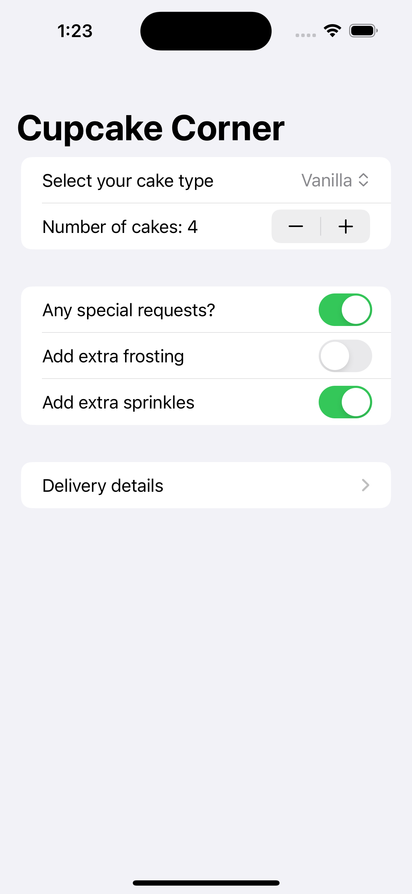
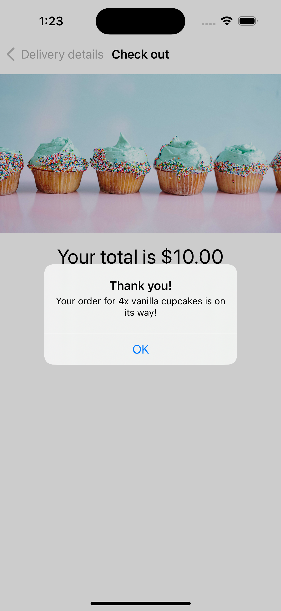

# CupcakeCorner

Cupcake Corner is an iOS app developed using SwiftUI, designed to streamline the process of ordering making online request on iOS devices. With a user-friendly interface and efficient navigation, Cupcake Corner allows users to select their favorite cupcake flavors, customize orders with special requests, and provide a delivery address.

    
    
    

## Features

- **Customization Options**: Users can choose from a variety of cupcake flavors and customize their orders with options for extra frosting or sprinkles.
- **Address Validation**: The app includes simple validation to ensure all fields are filled before placing an order.
- **Order Management**: Users can review their order details before final submission.

## Network Communications

Since this app was built for educational purposes, it does not connect to a backend server. Instead, I used [ReqRes](https://reqres.in), an online service that simulates API behavior by echoing back any sent data. This setup is ideal for testing, as it allows for experiencing real responses and debugging network interactions without the need to maintain a backend infrastructure.

## How to Use

1. Open the app to start your order by choosing your favorite cupcake flavor.
2. Customize your selection with additional toppings or special requests.
3. Enter your delivery details.
4. Review your order summary and proceed to checkout.
5. Confirm your order and get real-time updates until your cupcakes are delivered.

## Technologies Used

- **SwiftUI**: Used for crafting the app's interface, ensuring a smooth and modern user experience.
- **Swift**: Powers the backend logic, from handling form validation to managing network requests.
- **Xcode**: The essential IDE for developing, testing, and deploying the iOS application.

## Getting Started

To run this project locally, you'll need:

- Xcode installed on your Mac.
- Clone this repository to your local machine.
- Open the project in Xcode.
- Build and run the project on a simulator or your iOS device.

## Credits

This project is part of the ["100 Days of SwiftUI"](https://www.hackingwithswift.com/100/swiftui) course by Paul Hudson. I learned how to build this game and further develop my SwiftUI skills through the course.

## Learning Experience

In addition to following the main project instructions, I completed extra challenges provided at the end of the course where there were no instructions.
